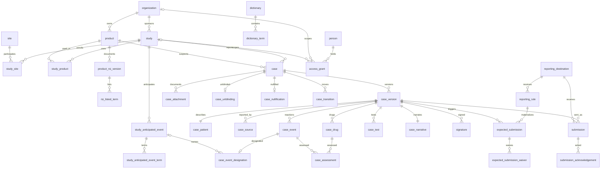

# Data model

Postgres is the system of record. Schema lives in `packages/db/src/schema.ts` (Drizzle);
DDL that Drizzle can't express (audit triggers, immutability and lock guards, the
reporting-obligation engine, derived-status views) lives in the companion SQL migrations
`0001_audit_and_views.sql`, `0002_app_role.sql`, `0003_sync_jit_off_and_canonical_hash_time.sql`
and `0004_anticipated_and_disagreement.sql`. Everything below is a table unless
marked *view*. Element IDs in parentheses (C.1.1, E.i.3.2, G.k.9.i, ...) are ICH E2B(R3)
Implementation Guide data elements; the schema is shaped by that standard so an ICSR can be
exported without a mapping layer (ADR-0009).

## Organizational spine

- **organization**: name, kind (`sponsor` | `cro` | `site_org`). A CRO instance hosts
  several sponsor organizations; grants scope to them (ADR-0015).
- **study**: protocol_number (unique), title, phase, status, sponsor_org_id, ind_number,
  eu_ct_number (C.5.1.r study registration), is_blinded, study_type (C.5.4).
- **site** / **study_site**: the reporting site with its ISO 3166-1 alpha-2 country, which
  feeds the reporter country (C.2.r.3) and country of occurrence (E.i.9).
- **product** and **study_product**: an investigational or comparator product owned by a
  sponsor organization, with its role in each study (`imp` | `comparator` | `placebo` |
  `background`).
- **product_rsi_version**: the Reference Safety Information in effect for a period (the
  Investigator's Brochure section or label version, ICH E2A §II.C): label, effective_from,
  effective_to (the row's one permitted mutation, an ending), document_sha256 pointing at
  an attachment, approved_by. **rsi_listed_term** (immutable): the MedDRA Preferred Terms
  the version lists, with an optional listedness note ("listed as Grade ≤ 3"). Expectedness
  is derived against the version in effect at event onset, following Regulation (EU)
  536/2014 Annex III §2.2(8); the awareness date is the fallback when onset is unknown.
- **study_anticipated_event**: a serious adverse event the study's safety surveillance plan
  anticipates in the population independent of the drug (FDA, Sponsor Responsibilities:
  Safety Reporting Requirements and Safety Assessment for IND and BA/BE Studies, December
  2025, §III.C, §V.A; ADR-0019): label (one medical concept), `prespecified` with a
  `plan_reference`, or not prespecified with a `justification` (§VI.A), an optional
  `predicted_rate` with `rate_unit` and `rate_basis` (a CHECK forbids a rate without both),
  effective_from, effective_to (the one permitted mutation), approved_by.
  **study_anticipated_event_term** (immutable): the preferred terms that make up the
  concept. Distinct from the RSI: the RSI decides expectedness, this list decides what the
  sponsor does not report to FDA as an individual IND safety report.
- **person**: email (unique), names. **access_grant**: role (`admin` | `case_processor` |
  `medical_reviewer` | `read_only` | `ingest`), scoped to a sponsor organization, to a study,
  or unscoped (instance-wide); `revoked_at` is a dated fact, never a delete.
- **reporting_destination**: an authority, ethics committee, investigator group, or
  partner that receives submissions: name, kind, country, e2b_receiver_id, default_format,
  optionally owned by a sponsor organization.
- **app_meta**: key/value operational facts (default dictionary, importer provenance).

## Dictionary

- **dictionary**: a loaded MedDRA (or, later, WHODrug) release: type, version, terms_count,
  `is_demo_subset`, source_sha256, loaded_by. The only rows shipped in this repository are
  the labeled illustrative subset the seed creates; the licensed distribution is loaded
  verbatim by `pnpm db:import-meddra` and never vendored (ADR-0005). Immutable after load: a
  new release is a new row.
- **dictionary_term**: one row per Lowest Level Term with its full primary path (PT, HLT,
  HLGT, SOC), a normalized term for exact matching, a trigram index for search, and
  `is_current`. Deliberately not row-audited: reference data reloadable from the licensed
  files, with the audited header carrying counts and the source hash.

## Case model

- **case**: the identity that stays constant across every transmission (C.1.8.1
  worldwide_unique_id, unique; C.1.1 sender_case_id, unique), report_type (C.1.3: `study` |
  `spontaneous` | `other` | `unknown`), study_id (null for spontaneous), product_id (the
  primary suspect, which anchors RSI lookup and DSUR grouping), first_received_date (C.1.4),
  received_via (`email` | `fax` | `phone` | `edc_push` | `other`) and received_ref (the
  message id, fax cover, or call log the report arrived with), and, for machine intake,
  source_system, source_ref, the as-received payload and its SHA-256. `replaces_case_id`
  links a resubmission to the nullified case it replaces (a
  nullified case needs a new C.1.1 and C.1.8.1, IG C.1.11). Identity columns are guarded by
  trigger.
- **case_version**: version_number (unique per case), kind (`initial` | `follow_up` |
  `amendment`), info_received_date (C.1.5), **awareness_date** (day zero of every clock:
  the sponsor's first knowledge that the case meets the minimum criteria, E2A §III.B.3;
  defaults to C.1.5, and `awareness_rationale` is required whenever they differ),
  received_at, dictionary_id (the MedDRA version pinned for this ICSR), created_by. Mutable
  while unsigned; locked forever by its first signature (ADR-0006).
- One set of children per version, cloned from the previous version when a follow-up or
  amendment is opened:
  - **case_patient** (D): initials, subject_number (D.1.1.4), study_site_id, age with unit
    and group, sex (ISO 5218), weight, height, medical history text, death date and cause
    (D.9). Pseudonymous by design; birth dates are avoided.
  - **case_source** (C.2.r): the reporters: names, organization, country, qualification,
    whether primary for regulatory purposes (C.2.r.5), and a link to a known person.
  - **case_event** (E.i): reported term, the MedDRA LLT/PT/HLT/HLGT/SOC snapshot with the
    dictionary it came from, six seriousness criteria as booleans (E.i.3.2 a–f), onset and
    end dates, outcome (E.i.7), country of occurrence, medically confirmed.
  - **case_drug** (G.k): role (`suspect` | `concomitant` | `interacting` |
    `not_administered`, G.k.1), product_id, name as reported, blinded flag (G.k.2.5), lot,
    indication PT, dose, route, start and end, action taken (G.k.8).
  - **case_assessment** (G.k.9.i): one row per drug × event × assessor (`reporter` |
    `sponsor`): reasonable_possibility (the E2A "cannot be ruled out" boolean),
    causality method and result, rechallenge, and an optional expectedness override with
    a required rationale (E2A §II.C.2: a more specific or more severe form of a listed
    term is unexpected) recording the RSI version consulted. The reporter's and the
    sponsor's rows coexist; the sponsor never edits the reporter's (Regulation (EU)
    536/2014 Annex III §2.1 ¶4), and a difference between them is derived, never stored
    (ADR-0020).
  - **case_event_designation**: the sponsor's designation of an event as anticipated in the
    study population, naming the concept on the study's list, or explicitly not
    anticipated, with an optional rationale (ADR-0019). Sponsor-only (`assess`), cloned
    into follow-up versions, locked with the version, and part of the version hash only
    when a version has any, so versions hashed before the table existed keep their hash.
  - **case_test** (F.r) and **case_narrative** (H.1 narrative, H.2 reporter comments,
    H.3.r sender's diagnosis, H.4 sender's comments).
- **case_attachment** (immutable): source documents, correspondence, and the exact bytes
  of every submitted payload, content-addressed by SHA-256 into the blob store
  (ADR-0013), with file name, MIME type, size, uploader, and provenance.
- Facts about a case, each immutable and dated:
  - **case_transition**: the intent transitions that no other fact implies
    (`data_entry`, `medical_review`, `closed`), with a required note when a reviewer
    returns a version to data entry.
  - **signature**: case_version_id, signer, meaning (`medical_review` | `approval`),
    signed_sha256 (the version hash at signing, 21 CFR 11.70), reauth_method and
    reauth_at (NOT NULL from birth, 21 CFR 11.200).
  - **case_unblinding**: at most one per case: arm label and role, when, by whom, why, and
    the code-break reference in the randomization system (ADR-0008).
  - **case_nullification**: at most one per case: reason (C.1.11.2). A trigger rejects new
    versions of a nullified case.
- **submission** (immutable): what was actually sent: case_version_id, destination, kind
  (`initial_notification` | `initial_report` | `follow_up_report` | `amendment` |
  `nullification` | `notification_letter`), format, sent_at and by, the payload's SHA-256
  (an attachment of kind `submission_payload`), a copy of the version hash sent, and the
  message identifier (N.2.r.1). A guard trigger requires an approval signature whose hash
  equals the current version hash. **submission_acknowledgement** (immutable): received_at,
  ack code (`AA` | `AE` | `AR` | `CA` | `CR` per IG §4.0, or `manual_receipt`), error text.

## Reporting-obligation engine

- **reporting_rule**: a row per obligation a destination imposes: optional scope
  (sponsor organization, study, product), destination, name and citation, report types
  and version kinds it applies to, obligation_kind (`initial` | `follow_up` |
  `nullification`), a predicate over `serious`, `unexpected`, `related`, and
  `fatal_or_life_threatening` (each nullable, null meaning "don't care"; the predicate is
  evaluated event by event, so a SUSAR is a single event that is serious, unexpected, and
  related at once), the causality basis (`either` | `sponsor` | `reporter`),
  `excludes_anticipated` (an event the sponsor designated anticipated in the study
  population does not satisfy the rule; set on the seeded FDA IND rules, never on the EU CTR
  ones, ADR-0019), whether a prior submission is required, timeline_days, due_soon_days,
  the submission kinds that satisfy it, and effective dates. Rules change by ending one row
  and inserting another; timelines are never edited in place (ADR-0007).
- **expected_submission**: the materialized obligation: rule, case, triggering
  case_version, obligation_kind, clock_start_date, due_date; unique per rule × version.
  `pv_sync_expected_submissions(case_version_id)` inserts what is missing and recomputes
  due dates for open versions; an `initial` obligation belongs to the earliest version at
  which the rule first matched, and later versions that still match add nothing. Rows for
  a still-open version that no longer match and were never discharged are removed; the
  removal is audited.
- **expected_submission_waiver**: a recorded judgment that an obligation is not required
  (a placebo subject after unblinding, E2A §III.E.1; a protocol-defined endpoint event),
  with reason, waiver, and revocation as dated facts.
- *v_case_minimum_criteria*: the four ICH E2B(R3) §3.3.1 conditions per version
  (identifiable patient, identifiable reporter, at least one event, at least one suspect
  or interacting drug) and which are missing. No clock runs before all four hold.
- *v_case_event_reportability*: per event: serious, fatal or life-threatening,
  expectedness (sponsor override first, else the RSI in effect at onset, else
  `unexpected` because no RSI was in effect), the basis of that answer, and relatedness
  per assessor. An event with no assessment on a suspect drug counts as related and is
  flagged `causality_assessed = false`; the fail-safe direction is to over-report. Appended
  in 0004: `causality_disagreement` (both parties assessed and their recorded opinions
  differ), `anticipated` with its basis (`prespecified` | `added_during_trial`), concept
  and plan reference, and `anticipated_candidate` (an in-effect concept of the study lists
  this PT: a hint, never a designation).
- *v_case_reportability*: per version: expedited class (`7d` when some event is serious,
  unexpected, related, and fatal or life-threatening; `15d` when some event is serious,
  unexpected, and related; else `none`) with the reason in words. The class is
  authority-agnostic: an anticipated SAE is still a SUSAR for the EU rules; the reason
  says "anticipated in the study population (aggregate review)" and `all_susar_anticipated`
  is what an FDA rule with `excludes_anticipated` acts on. Also `any_anticipated` and
  `any_causality_disagreement`.
- *v_rule_evaluation* and *v_rule_match*: the pure predicate, evaluated once as written and
  once ignoring the anticipated exclusion, so "why does this rule apply to this case" is a
  documented query, not a code path. *v_rule_anticipated_exclusion* lists the rules a
  designation held back, with the concept names; nothing materializes from it.
- *v_expected_submission_status*: `not_required` | `acknowledged` | `submitted` |
  `superseded_by_follow_up` | `overdue` | `due_soon` | `pending`, plus `on_time` and
  `days_remaining`. A rejected acknowledgement leaves the row `submitted` so it stays
  visible; a resend is a new submission.
- *v_case_queue*: one row per case: derived workflow state, expedited class, next due
  date, days remaining, counts of open and overdue obligations, latest signature,
  whether causality has been assessed, attachments, source system, how the report was
  received, and whether any event is designated anticipated or carries a causality
  disagreement.
- *v_dsur_sar_line_listing* (E2F §3.7.2) and *v_dsur_sae_summary* (E2F §3.7.3): the
  interval line listing of serious adverse reactions by trial, SOC, and PT, and the
  cumulative tabulation of serious adverse events by SOC and arm. The arm comes from the
  unblinding fact where one exists and reads `blinded` otherwise. The line listing's
  `sponsor_comment` carries the sponsor's position when it differs from the reporter's
  (E2F §3.7.2(l)) and the anticipated concept when one is designated.
- *v_reporting_compliance*: per sponsor, study, and destination: closed obligations, how
  many were on time, how many late, how many are still open and overdue, and the on-time
  percentage.
- *v_signature_integrity*: every signature with the version hash recomputed now and
  whether it still matches.

### Workflow state is derived

There is no status column on a case. `v_case_queue` derives the state by precedence:
`nullified` (a nullification fact exists), then `closed` (latest transition), then
`submitted` (a submission exists on the latest version), then `approved` (an approval
signature exists on it), then `medical_review` or `data_entry` (the latest transition on
that version), then `data_entry` for a valid version with no transition, and `intake` for
a version that does not yet meet the minimum criteria. A new follow-up version therefore
starts in `data_entry` by construction. An intake item is an ordinary case whose first
version is not yet valid; the `ingest` role can insert cases, children, and attachments,
and nothing else.

### Views are public API

The `v_*` views are not internals: they are the documented, stable query surface. A
safety physician with a read-only Postgres connection (DBI/dbplyr in R, psycopg or
SQLAlchemy in Python) reads the same derived truth the REST API serves; the two can never
disagree, because the API is `SELECT`s over these views. Treat view columns like endpoint
fields: additive changes are safe, renames and removals are breaking.

## What lives where

Three kinds of record share the schema, and it helps to know which is which when a
monitor asks "who said this event was related" or "why is nothing due to FDA".

- **As-reported event data**: the E2B(R3) sections of a version (patient, sources, events,
  drugs, tests, narrative) and the reporter's causality row. This is what the site told
  the sponsor, coded as it arrived. It is versioned, cloned into follow-ups, locked by the
  first signature, and never rewritten by a reviewer: a correction is a new version with
  new information behind it. The EDC's adverse-event log is not here; the SAE report the
  site sent is (`received_via`, the source-document attachment).
- **Sponsor assessment layer**: the sponsor's causality row (`case_assessment`,
  `assessor = 'sponsor'`), the expectedness override against the RSI, the anticipated
  designation against the study's list (`case_event_designation`), and the unblinding fact.
  These are judgments the sponsor's medical reviewer owns; they sit beside the reporter's
  data, never on top of it, and both travel in the report. `assess` writes them.
- **Operational records**: the transitions, the obligations the rules derive
  (`expected_submission` and its status), what was sent and acknowledged, waivers,
  signatures, and the digest. None of it is entered as status; all of it is derived from
  the two layers above plus the rule rows. What a monitor "needs to do" is the queue tile
  or digest section that reads the same views.
- **Not in pv-core, by design**: the EDC's AE case report form and its queries (the site
  reconsiders a causality assessment there or by letter, and the answer arrives here as
  follow-up information), monitoring visits and other CTMS tasks, TMF filing, and the
  site's own IRB reporting. pv-core tracks the sponsor's obligations to investigators and
  ethics committees as destinations, not the site's.

## Audit trail

- **audit_event**: append-only, written by database triggers on every INSERT/UPDATE/DELETE
  to domain tables, not by application discipline. Captures actor (from
  `set_config('pv.actor_id', …)` established per transaction by the API), action, entity,
  full before/after row images, and a SHA-256 hash chained to the previous event so
  retroactive edits are detectable (`pv_verify_audit_chain()`, from any session time zone:
  the timestamp is hashed as a canonical UTC rendering). Signatures, submissions,
  acknowledgements, attachments, unblinding, nullification, transitions, listed RSI terms,
  and loaded dictionaries reject UPDATE and DELETE for every role. Case versions and their
  children reject them once a signature exists.

## Deliberate choices

- **Versions are mutable until signed.** Draft edits land in the audit trail as
  before/after images rather than as junk versions; the first signature freezes the
  version and every later change is a new version. This is the trade edc-core made for
  form data and ctms-core for documents, applied to an ICSR.
- **The awareness date is a column, not a computation.** Day zero is a regulatory
  judgment (first knowledge that the minimum criteria are met); the schema records it,
  defaults it to the date the information was received, and requires a rationale when the
  two differ.
- **Rules are rows.** Timelines and predicates are data an administrator can read and end,
  and every clock is explainable by `v_rule_match`.
- **Fail-safe defaults over-report.** An unassessed event is treated as related and an
  event with no RSI in effect as unexpected; both are visible in the queue rather than
  silent.
- **Anticipated is a designation, not a third expectedness.** The RSI decides expected or
  unexpected; the study's anticipated-event list and the sponsor's per-event designation
  decide what FDA does not receive as an individual IND safety report (ADR-0019). The
  effect is a rule attribute (`excludes_anticipated`), so the EU CTR rules never see it,
  and a held-back rule is listed by name rather than silently absent.
- **Two causality opinions, one derived disagreement.** The reporter's and the sponsor's
  rows coexist and are both transmitted; a difference is a computed column that surfaces
  in the queue, the DSUR comment, and the digest, and the rule's causality basis says which
  opinion starts its clock (ADR-0020).
- **Arms live in one place.** `case_unblinding` is the only table with an arm at rest;
  `pv_readonly` cannot read those columns, and aggregate views expose arms only where
  the DSUR needs them.
- **Attachments and payloads are content-addressed.** The SHA-256 is both the storage key
  and the identity a submission record points at; with the s3 driver and Object Lock the
  bytes are WORM (ADR-0013).
