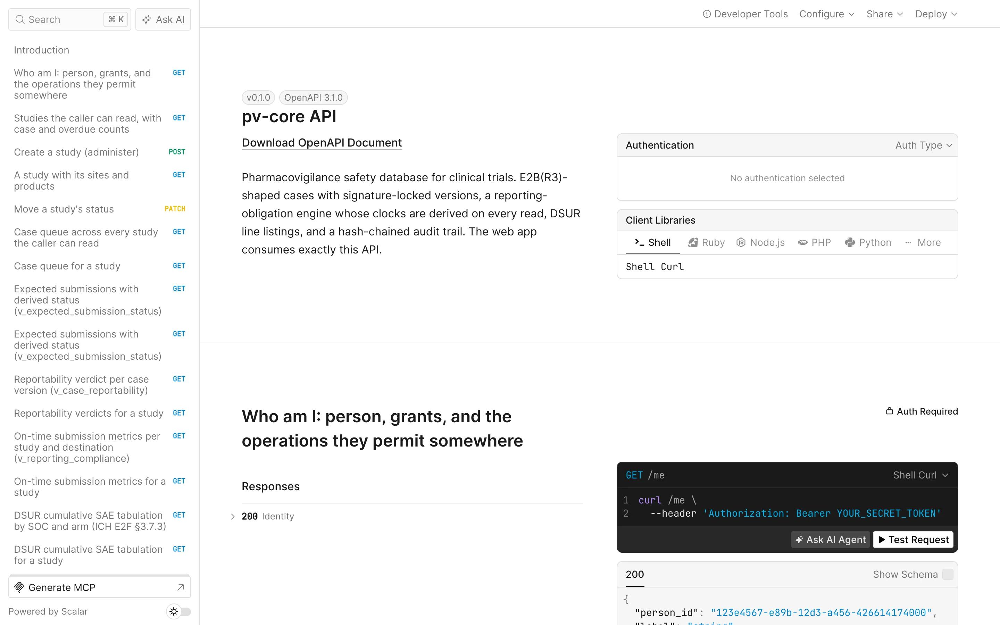

Every task in the [user guide](/pv-core/user-guide/) is one call against the same API the
app uses. The interactive reference lives at `http://localhost:8789/docs`; this page is
the R and curl version of the everyday ones. Tokens are the dev personas from
[getting started](/pv-core/getting-started/#who-you-are-in-the-demo).

## An R client in five lines

```r
library(httr2); library(dplyr)

pv <- function(path, ..., token = "dev-reviewer-token") {
  request("http://localhost:8789") |>
    req_url_path_append(path, ...) |>
    req_auth_bearer_token(token) |>
    req_perform() |>
    resp_body_json(simplifyVector = TRUE) |>
    as_tibble()
}
```

## The safety physician's morning

Open clocks across every study you can read, overdue first:

```r
pv("expected-submissions") |>
  filter(status %in% c("overdue", "due_soon", "pending")) |>
  select(sender_case_id, protocol_number, destination_name, rule_name,
         due_date, days_remaining, status) |>
  arrange(days_remaining)
```

The queue itself, with derived state and expedited class:

```r
pv("queue") |> select(sender_case_id, state, expedited_class, reportability_reason,
                      next_due_date, days_remaining, overdue_obligations)
```

Why is a case reportable to a destination? Ask the engine:

```r
q <- pv("queue") |> filter(sender_case_id == "US-CORC-2026-0001")
pv("case-versions", q$latest_version_id, "rule-matches") |>
  select(rule_name, citation, clock_start_date, timeline_days)
```

## DSUR line listing

```r
library(gt)
study_id <- pv("studies") |> filter(protocol_number == "CORC-2201") |> pull(id)
pv("studies", study_id, "dsur", "sar-line-listing") |>
  select(sender_case_id, subject_number, arm_label, soc_term, pt_term,
         onset_date, outcome, sponsor_related, expectedness, rsi_label) |>
  gt(groupname_col = "soc_term")
pv("studies", study_id, "dsur", "sae-summary")
```

## Recording a submission and its acknowledgement

```r
post <- function(path, body, token) {
  request("http://localhost:8789") |> req_url_path_append(path) |>
    req_auth_bearer_token(token) |> req_body_json(body) |> req_perform() |> resp_body_json()
}
sub <- post(paste0("case-versions/", version_id, "/submissions"),
            list(destination_id = fda_id, kind = "initial_report", format = "e2b_r3_json"),
            "dev-processor-token")
post(paste0("submissions/", sub$id, "/acknowledgement"), list(ack_code = "CA"),
     "dev-processor-token")
```

The server refuses (409) unless the version carries an approval signature bound to its
current hash, and for the E2B(R3) JSON format renders and stores the exact bytes it sent
(`sub$payload_sha256`, fetchable at `/files/{sha256}`).

## curl

```sh
TOKEN=dev-admin-token
curl -s -H "Authorization: Bearer $TOKEN" localhost:8789/queue | jq '.[] | {sender_case_id, state, next_due_date}'
curl -s -H "Authorization: Bearer $TOKEN" localhost:8789/audit-chain/verify
curl -s -H "Authorization: Bearer dev-reviewer-token" -H 'Content-Type: application/json' \
  -X POST localhost:8789/case-versions/$VERSION/sign \
  -d '{"meaning":"approval","reauth_token":"dev-reviewer-token"}'
```

Every route, its parameters, and its response shape are in the interactive API reference
at `/docs` on the API origin, generated from the same OpenAPI 3.1 document the app is
built against; requests can be tried from the page with a dev token.



## Read-only SQL

The `v_*` views are public API. See [direct SQL access](/pv-core/sql-access/).
