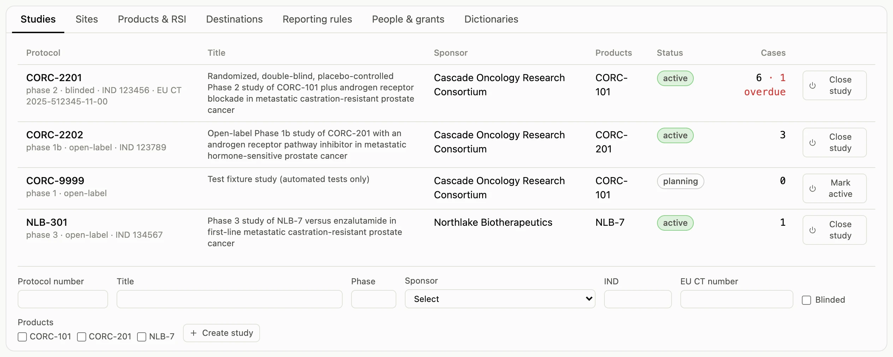
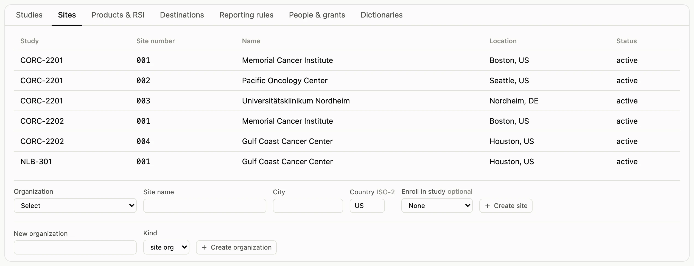
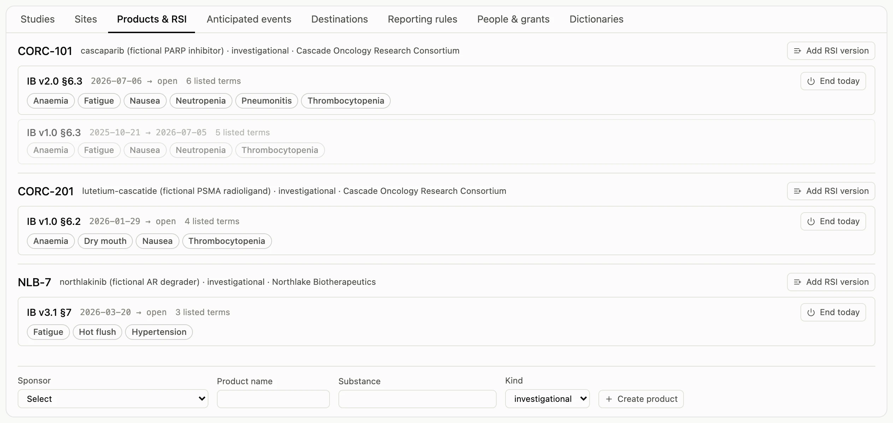
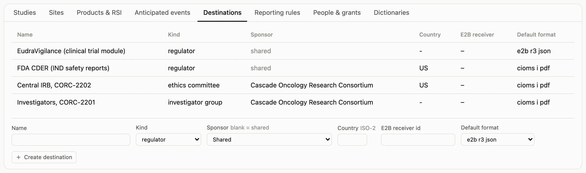
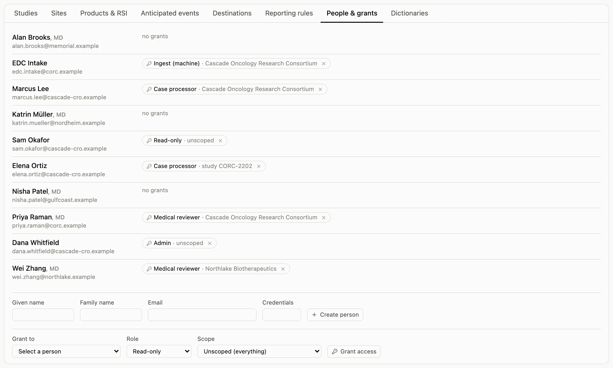
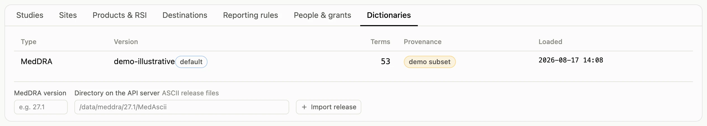

The **Admin** page is where a CRO sets an instance up for a sponsor's program. Everything
here is data the case pages read; nothing is configuration in a file. Non-administrators
can open the page and read it; the create forms and actions are absent for them.

## Studies, sites, products

A study belongs to a sponsor organization and lists its investigational products, its
sites (with country, which the reporter and event countries default from), and whether it
is blinded. Products belong to the sponsor too, so a sponsor-scoped grant covers them.

## Reference safety information

For each product, keep the RSI as dated versions: the Investigator's Brochure section (or
label) that lists the expected reactions, effective from a date, with its listed Preferred
Terms and, where useful, a listedness note ("listed as Grade ≤ 3"). Adding a new version
can end the previous one the day before. Expectedness on every event is derived from
these versions by onset date, so keeping them current is what keeps the clocks right.

## Destinations and reporting rules

A destination is a regulator, ethics committee, investigator group, or partner that
receives reports. A rule ties a destination to a timeline and a test over the case, scoped
to a sponsor, a study, or a product. Rules are never edited in place: end the old one and
add the new one, so a due date computed last year is still explainable this year. The
seeded rules cover FDA IND safety reports (21 CFR 312.32), EU SUSARs (Regulation (EU)
536/2014 Article 42), and investigator and IRB notifications.

## People and grants

A person is an email identity. A grant gives them a role (administrator, case processor,
medical reviewer, read-only, or intake service) at a scope: one study, one sponsor
organization, or the whole instance. Revoking a grant is a dated fact, and every grant
change is in the audit trail.

## Dictionaries

The list shows the loaded MedDRA releases and marks the demo subset for what it is. Import
a licensed release by pointing the importer at its ASCII directory; the release is loaded
verbatim and its file hash recorded, and new cases code against the default release.

