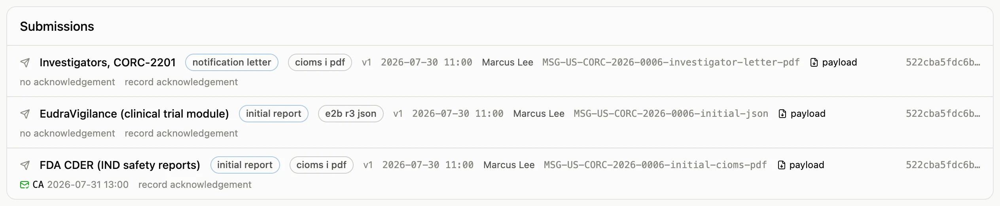

Two kinds of bytes hang off a case: the source documents you attach (SAE forms,
discharge summaries, correspondence) and the payloads of the reports that were sent. Both
are stored the same way: by the SHA-256 hash of the content, in a blob store outside the
database, with an immutable record row naming the file, its type and size, who attached
it, and where it came from.

Storing by hash has three consequences you will notice. The same file attached twice is
stored once. A submission record names exactly the bytes it sent, and anyone can fetch
them later and hash them again. And when the store is an S3 bucket with Object Lock, the
bytes cannot be changed or deleted for the retention period; the local directory the
development stack uses makes no such guarantee, and the deployment checklist says which
one you are running.

Attach from the case page; download from the attachments panel or from a submission row.
Reads are scoped: you can fetch the bytes of a case you can read, and no others.
