import { Code } from "@astrojs/starlight/components";
import digest from "../../../assets/generated/digest-CORC-2201.txt?raw";

Which reports are owed, to whom, and by when is decided by **reporting rules** that
administrators keep as data: a destination (a regulator, an ethics committee, an
investigator group), a timeline in calendar days, and a test over the case (serious,
unexpected, related, fatal or life-threatening). The seeded rules encode ICH E2A §III.B and
21 CFR 312.32 for the FDA (7 days for fatal or life-threatening unexpected reactions, 15
days for other serious unexpected ones, 15 days for follow-up information) and Regulation
(EU) 536/2014 Article 42 for SUSARs.

## Obligations

The moment a case is valid, the app materializes every obligation the rules imply, each
with its day zero (the awareness date) and due date. The **Obligations** panel on the
case shows them with a derived status:

| Status | Meaning |
| --- | --- |
| pending | Due later than the warning window |
| due soon | Due within the rule's warning window (three days by default) |
| overdue | Past due with nothing sent |
| submitted | A qualifying report was sent to that destination |
| acknowledged | The destination acknowledged it (E2B(R3) ACK codes, or a manual receipt) |
| superseded by follow-up | The latest version no longer triggers the rule |
| not required | A recorded judgment (a waiver with a reason) says no report is owed |

"Why does this rule apply" is a click away: the rule matches panel shows the predicate the
engine evaluated for the version.

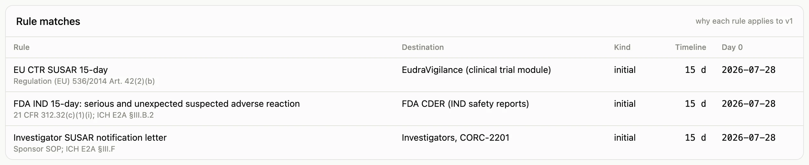

## Recording what was sent

Sending happens outside pv-core (a gateway, a portal, an email); recording it happens
here. Choose the destination, the kind of report (initial notification, initial report,
follow-up, amendment, nullification, notification letter), and the format. For CIOMS I,
Form FDA 3500A, and the E2B(R3) JSON format the app renders the document itself from the
approved version and stores the exact bytes; for anything else attach the file you sent.
The CIOMS I and 3500A renderings follow the official forms' field lists and name the
version hash on every page, so what was sent can always be traced to what was signed. The database refuses a submission unless the version
carries an approval signature bound to its current hash, and copies that hash onto the
submission record. Then record the acknowledgement when it arrives.

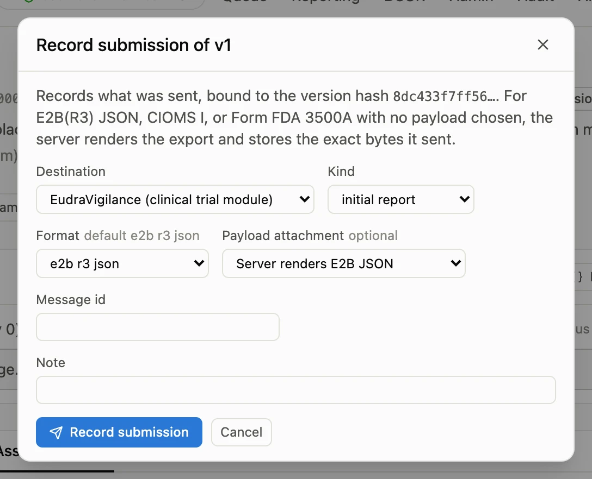

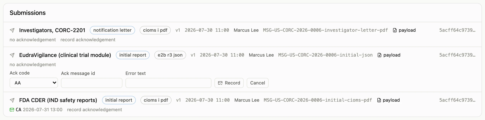

## Follow-ups

New information restarts a 15-day clock. Open a follow-up version: the app clones the
approved version, you enter what changed, and a new follow-up obligation appears with its
own day zero, while the initial obligation keeps its history (submitted, on time or not).
The [guided tour](/pv-core/evaluate/tour/#step-follow-up) shows a follow-up three days in.

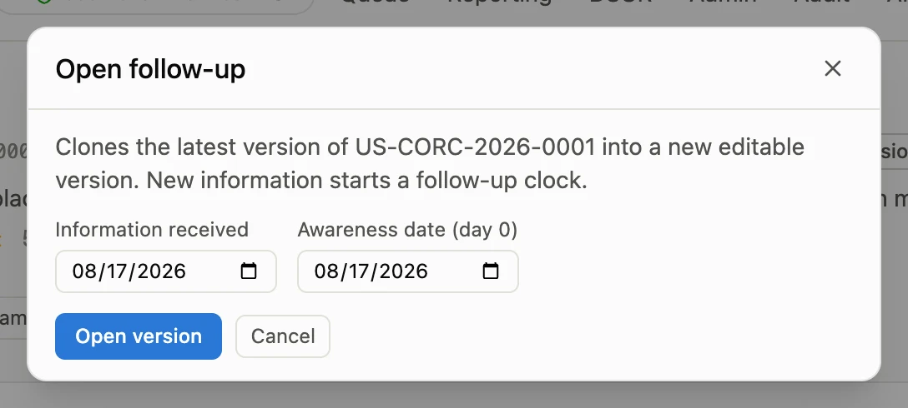

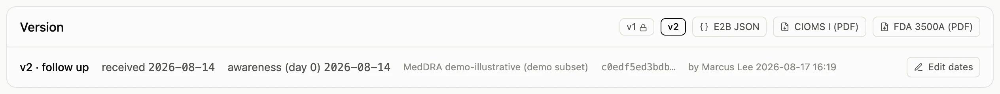

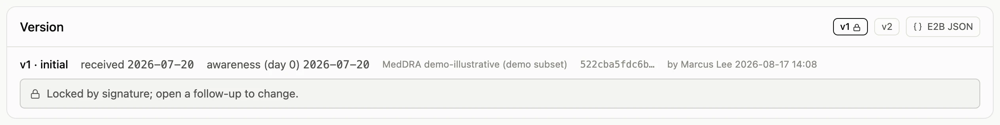

## Waivers, unblinding, nullification

Some obligations are not owed even though the rule matched: a subject who turns out to be
on placebo after unblinding, or a protocol-defined endpoint event. Record a **waiver**
with the reason; the obligation reads "not required" and the reason stays on the record.
Waivers can be revoked, which is itself a dated fact.

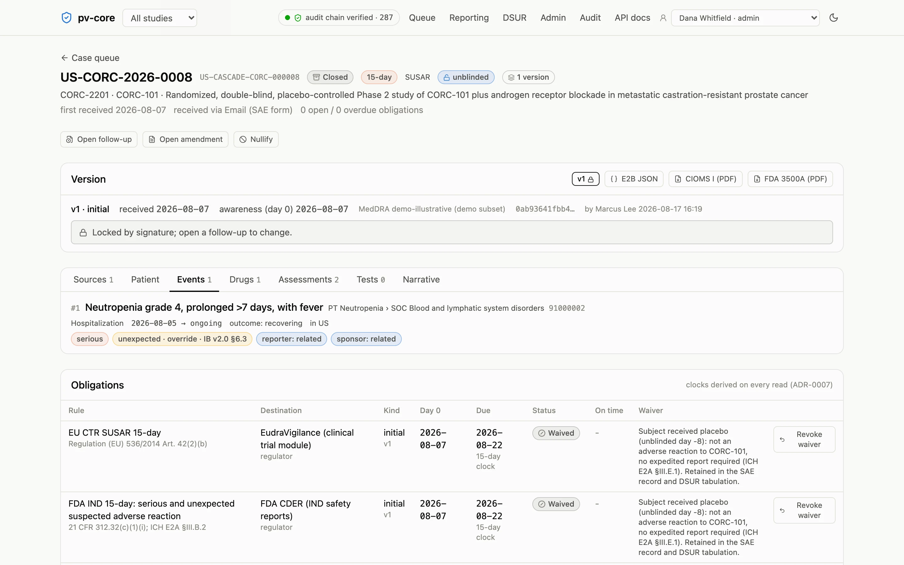

When a blinded case must be reported, the randomization system breaks the blind for that
subject and pv-core records the fact: the arm, when, why, and the code-break reference.
The arm appears only where the record needs it.

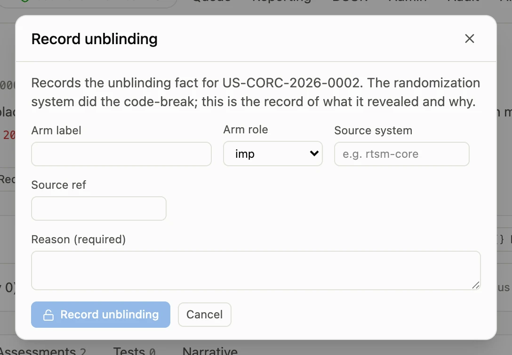

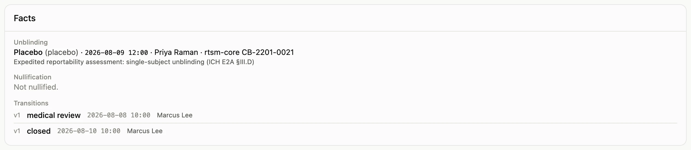

A duplicate or erroneous case is **nullified**, with a reason. The case keeps its history,
accepts no further versions, and its open obligations read "not required"; if the case
had already been submitted, a nullification report is owed and tracked like any other.

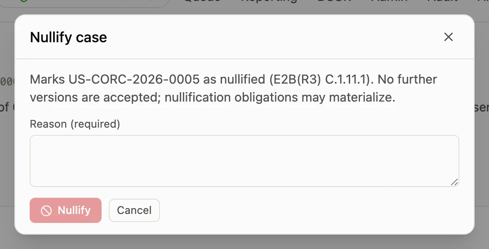

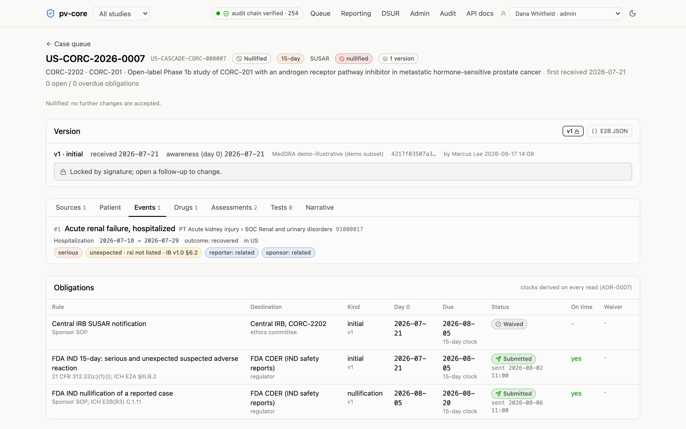

## The reporting page and the digest

The **Reporting** page is the same information across studies, grouped by due date and
filterable by status, with on-time metrics per study and destination. The same content
goes out as a plain-text email once a day (or however often the team schedules it) to
everyone whose grant covers the study: overdue and due-soon obligations, intake items,
cases waiting in medical review, unassessed causality, and the audit-chain status. The
digest stores nothing; it is a reading of the record at send time.

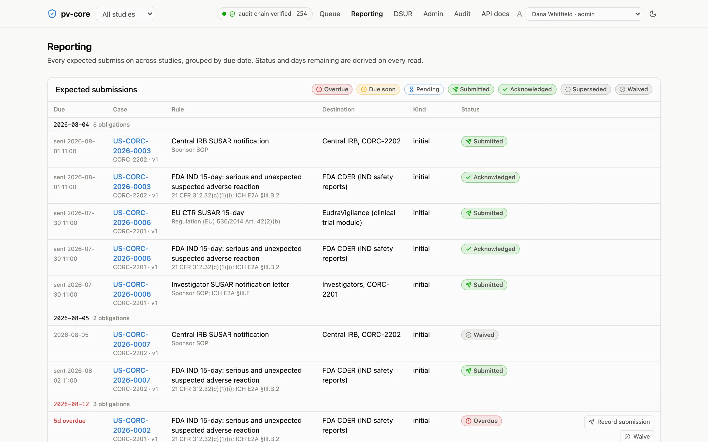

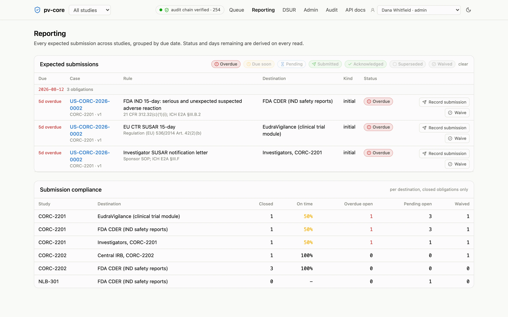

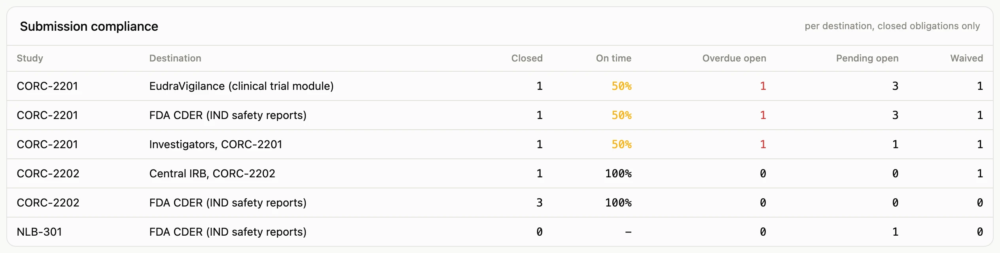

The digest for the seeded study, as its team would receive it on the day the screenshots
were generated:

<Code code={digest} lang="text" title="digest-CORC-2201.txt" frame="terminal" wrap />
