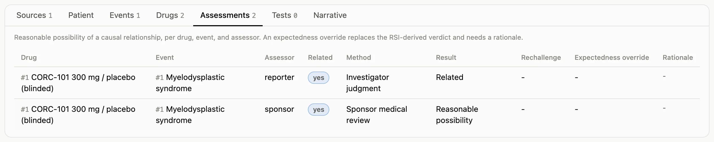
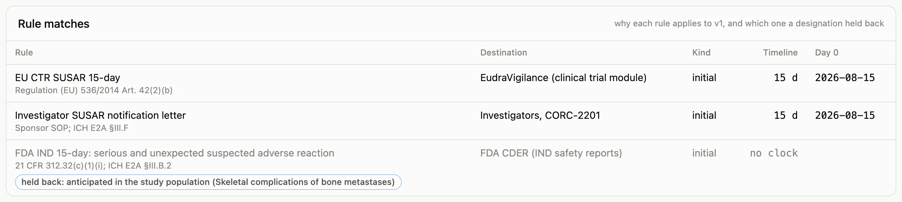
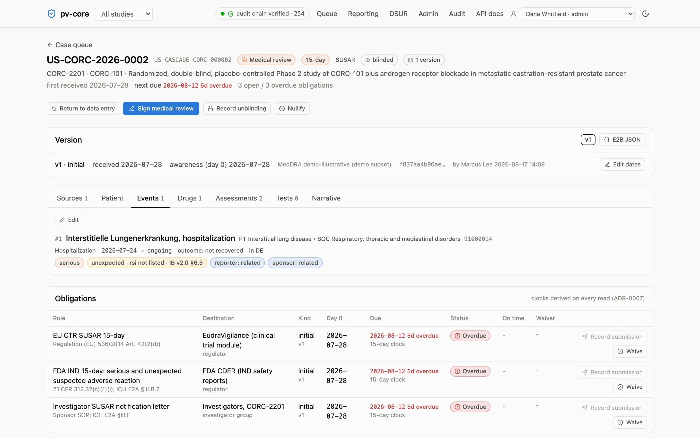
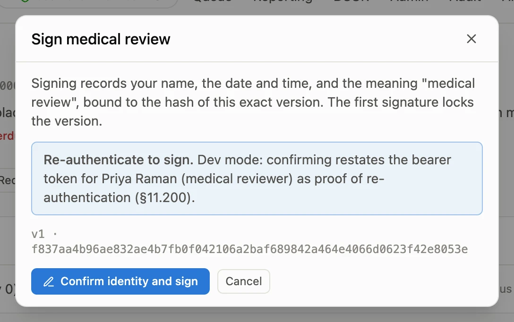
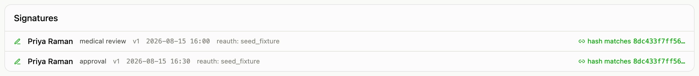

Reportability rests on three judgments per event: is it serious, is it unexpected, and is
it reasonably related to the study drug. The app records the first as facts on the event,
derives the second from the reference safety information, and records the third per drug
and event for both the reporter and the sponsor. The Events tab shows all three at a
glance; the [guided tour](/pv-core/evaluate/tour/#step-coding) follows one event through
them.

## Seriousness

The six criteria of ICH E2A §II.B are checkboxes on the event: death, life-threatening,
hospitalization or prolongation, persistent or significant disability, congenital
anomaly, and other medically important condition. Serious is any of them.

## Expectedness

Expectedness is judged against the reference safety information (the Investigator's
Brochure section, or the label) in effect **when the event occurred**. Administrators
keep the RSI as dated versions with their listed Preferred Terms; the app looks up the
version in effect at the event's onset date and marks the event expected if its Preferred
Term is listed and unexpected otherwise. Each event shows the verdict and its basis: the
RSI version consulted and whether the term was listed, or that no RSI was in effect (in
which case the event counts as unexpected, deliberately).

The safety physician can override the derived verdict, in either direction, on the
assessment: a listed term whose reported severity or specificity exceeds the listing is
unexpected (E2A §II.C.2), and the override must carry a rationale.

## Causality

Assessments live in a grid of drug × event × assessor. The reporter's assessment and the
sponsor's are separate rows; each records whether a reasonable possibility of a causal
relationship exists, plus the method, the result wording, and any rechallenge
information. Until the sponsor has assessed an event, the app treats it as related: the
fail-safe direction is to over-report, and the queue flags the case as
"causality unassessed" so the gap is visible rather than silent.

## When the sponsor disagrees with the site

The investigator's row is the site's opinion and it stays as reported; the sponsor never
edits it (Regulation (EU) 536/2014 Annex III §2.1 ¶4 says the investigator's assessment
"shall not be downgraded by the sponsor"). The medical monitor records their own row with a
result and a rationale, and both opinions travel with the report: the E2B(R3) export
carries both, and the DSUR line listing's comment column says when the sponsor disagrees
(ICH E2F §3.7.2(l)). The app marks the difference on the event, in the case header, in
the queue, and in the digest, so nobody has to remember it.

Which opinion starts a clock is each rule's decision, not the app's. Under 21 CFR 312.32
the sponsor's judgment decides an IND safety report, so the FDA IND rules run on the
sponsor's row (FDA, Sponsor Responsibilities, December 2025, §IV.A: do not report when the
investigator says related and your review finds no evidence; do report when the
investigator says not related and your review does); ICH E2A and the EU CTR count either
party, so those rules run on either. The seed shows both on one case: US-CORC-2026-0011,
where the investigator called an acute kidney injury related and the sponsor did not, owes
EudraVigilance and the investigators a 15-day report and owes FDA nothing.

If you want the site to reconsider, ask through the EDC query or a letter, and attach the
correspondence to the case; the site's answer is follow-up information and opens a new
version, where the investigator's row can change. There is no override and no
"resolved" flag: the record is the two opinions, on each version, with the audit trail
behind them.

## Anticipated serious adverse events

FDA's December 2025 IND safety reporting guidance separates *anticipated* from *expected*.
Expected is what the investigator's brochure lists. Anticipated is what the study
population brings on its own: consequences of the disease, of age, of a background
regimen, events "that may occur in the study population unrelated to an effect of a drug"
(§III.C), such as death from progressive disease in an oncology trial or a pathological
fracture in a bone-metastatic population. Such an event is still unexpected if it is not
in the brochure, but the guidance says it does not warrant an individual IND safety report
(§IV.A.2.a): the sponsor lists these events in the safety surveillance plan, coded as
MedDRA preferred terms with each entry one medical concept (§V.A), and reviews them in
aggregate instead.

In pv-core the list lives on the study (Admin › Anticipated events, kept by
administrators like the RSI, dated, never edited) and the judgment lives on the event. On
the Events tab, the medical reviewer designates each event as anticipated, naming the
concept from the plan, or as not anticipated, with an optional rationale; a concept the
plan did not foresee is added to the list first, with the clinical justification the
guidance asks for (§VI.A). The app hints when an event's preferred term is on the list,
and never designates by itself.

The designation changes exactly one thing: any rule marked "excludes anticipated events"
no longer applies to that event. The seeded FDA IND rules are marked; the EU CTR,
investigator, and IRB rules are not, because their texts have no such carve-out. So the
seed's case US-CORC-2026-0010, a pathological fracture through a known femoral metastasis,
still owes EudraVigilance and the investigators a 15-day report while the FDA IND rule is
shown as held back, by name, with the concept from the plan. Nothing is held silently:
the case header, the queue, the digest, and the Rule matches card all say so.

The guidance also asks the plan to state a predicted rate for each anticipated event and
where it came from, when the sponsor uses a rate to decide when to unblind (§V.A, §VI.C).
The list can hold that rate, and it refuses one without a stated basis; the app never
suggests a number. The [administration](/pv-core/user-guide/administration/#anticipated-serious-adverse-events)
page lists the public sources FDA names for such rates and what to keep in mind when
using them.

## Medical review and signing

When data entry is complete, send the case to medical review. The physician reviews the
sections and assessments, then signs the medical review and, when satisfied, the approval.
Signing asks you to re-authenticate; the signature records who, when, why, and the
cryptographic hash of the exact version signed. The first signature locks the version. If
something must change afterwards, open a follow-up (new information) or an amendment (a
correction): the app clones the version and the clock follows.

