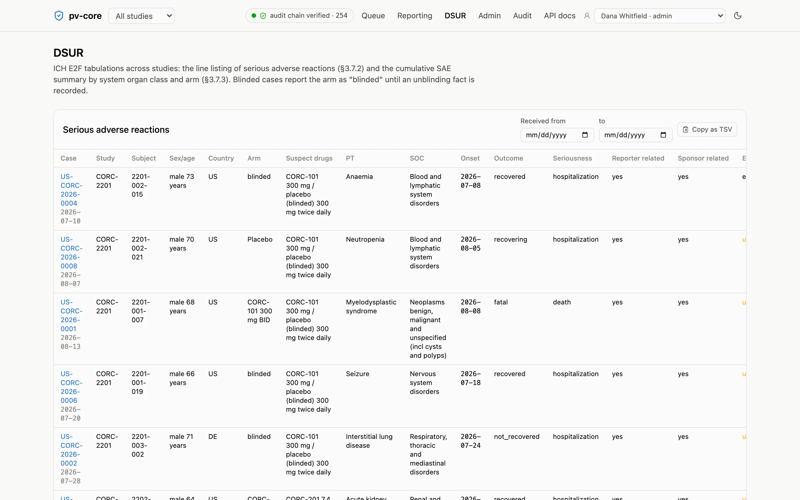
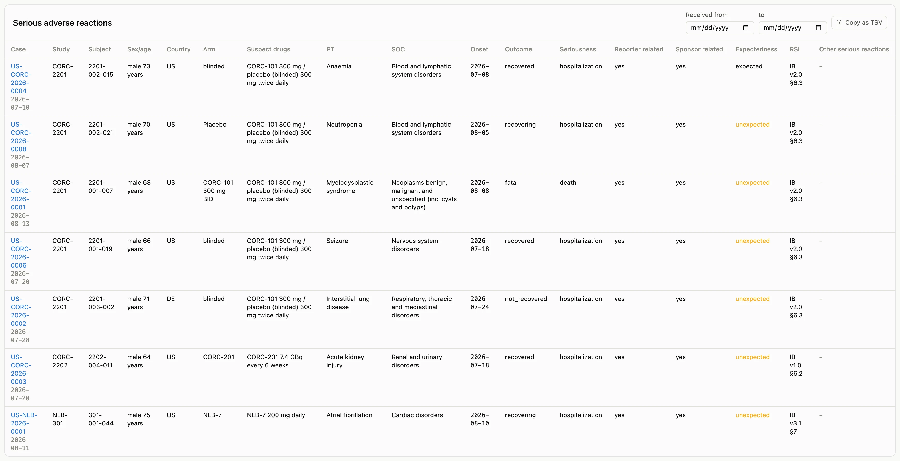
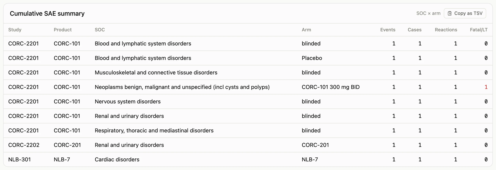

The Development Safety Update Report of ICH E2F wants two tables from the case record: an
interval line listing of serious adverse reactions (§3.7.2) and a cumulative tabulation of
serious adverse events by system organ class and treatment arm (§3.7.3). Both are views
over the cases, so the **DSUR** page is a study selector, a date range on the receipt
date, and the two tables.

## Line listing

One row per case, under its most serious reaction, ordered by trial, system organ class,
and Preferred Term: the case and subject identifiers, country, arm, suspect drugs, the
reaction, onset and outcome, causality as assessed by reporter and sponsor, expectedness
and the RSI version it was judged against, and any other serious reactions on the same
case. Only cases that are valid ICSRs and not nullified appear; a case is a reaction if
either the reporter or the sponsor considers it related, or if it has not been assessed
yet. The last column is the sponsor's comment, which E2F §3.7.2(l) reserves for the
sponsor's causality view when it differs from the reporter's; it also names the
anticipated concept when the sponsor designated the event anticipated in the study
population, so an anticipated SAE is listed like any other reaction, with the reason it
was not reported individually to FDA beside it.

## SAE tabulation

Counts of serious events, cases, reactions, and fatal or life-threatening events by
system organ class and arm. Blinded studies read `blinded` for every case whose blind is
intact; a case with a recorded unblinding shows its arm; open-label studies show the
product. Nothing is unblinded to prepare the tabulation.

Both tables copy as tab-separated text for the DSUR document, and the same rows are one
call away from R ([cookbook](/pv-core/cookbook/#dsur-line-listing)).
