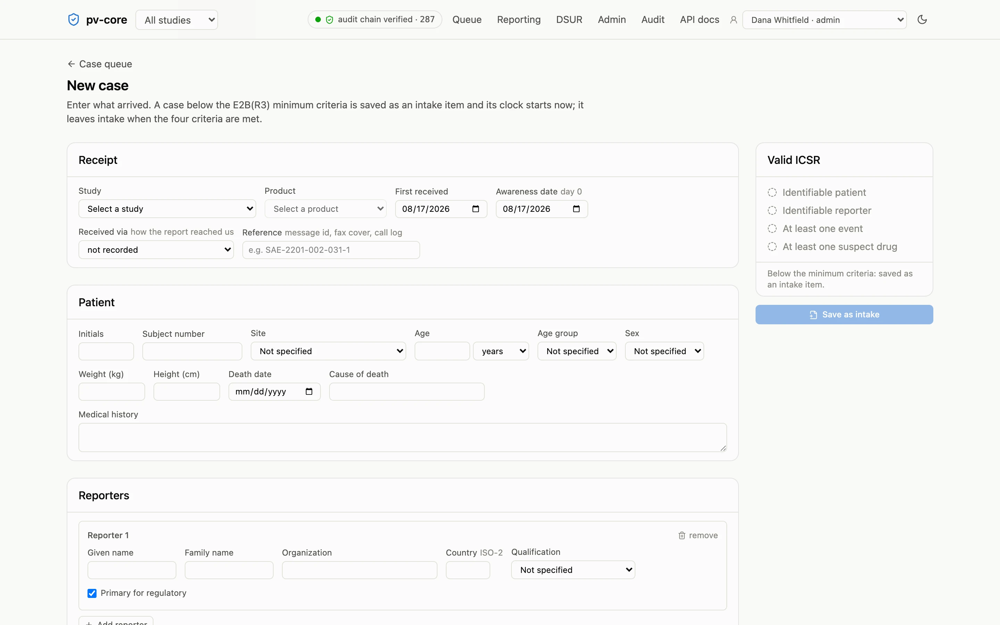
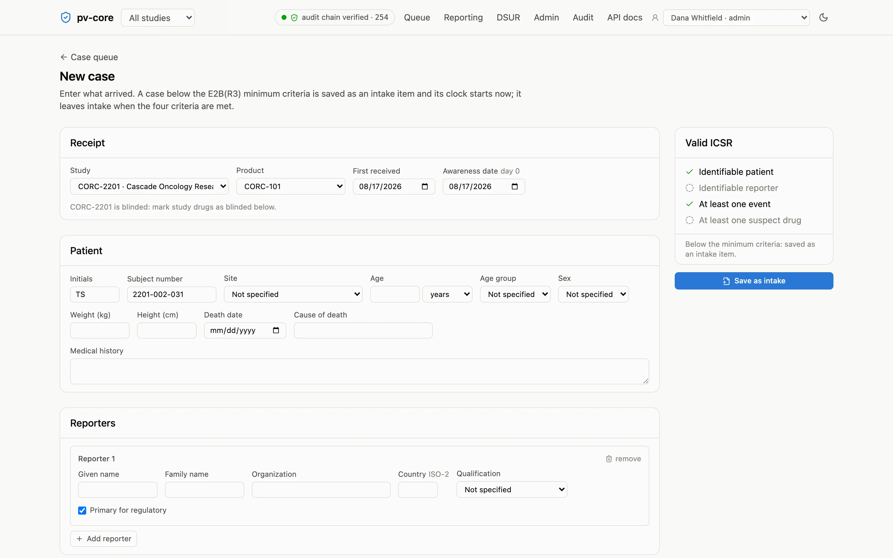
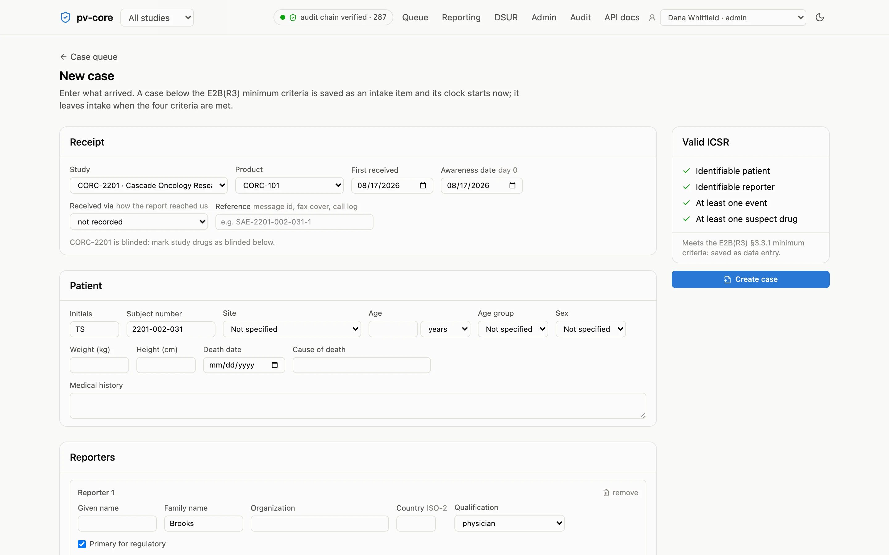
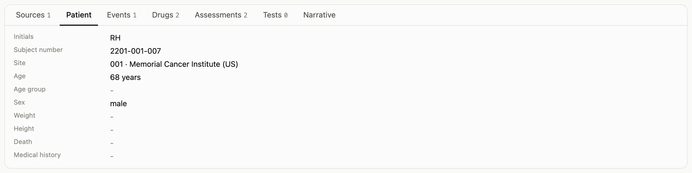
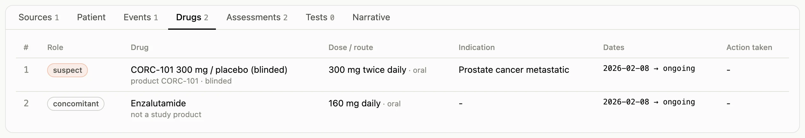
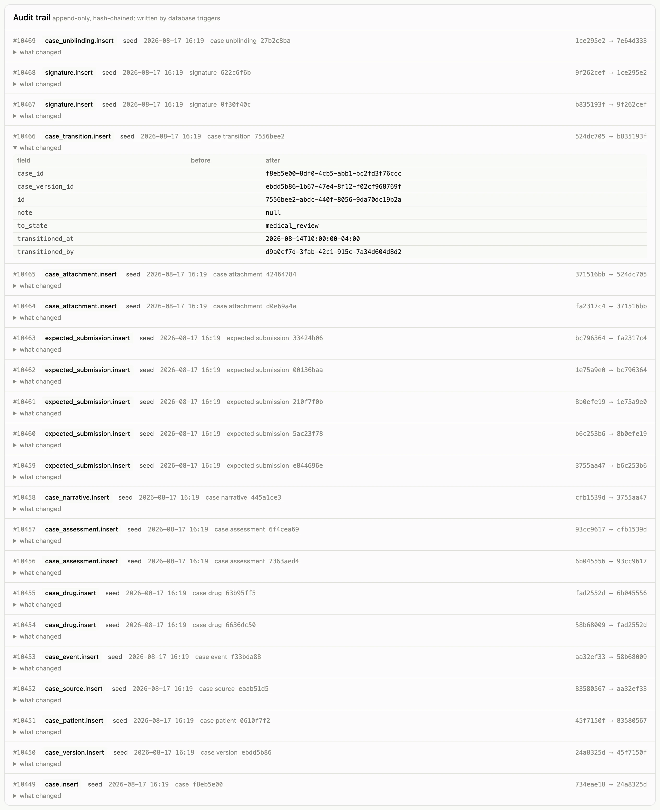
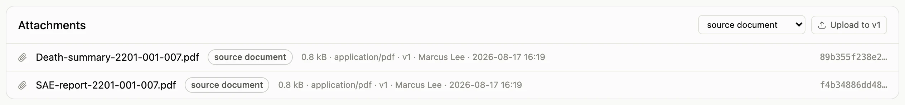
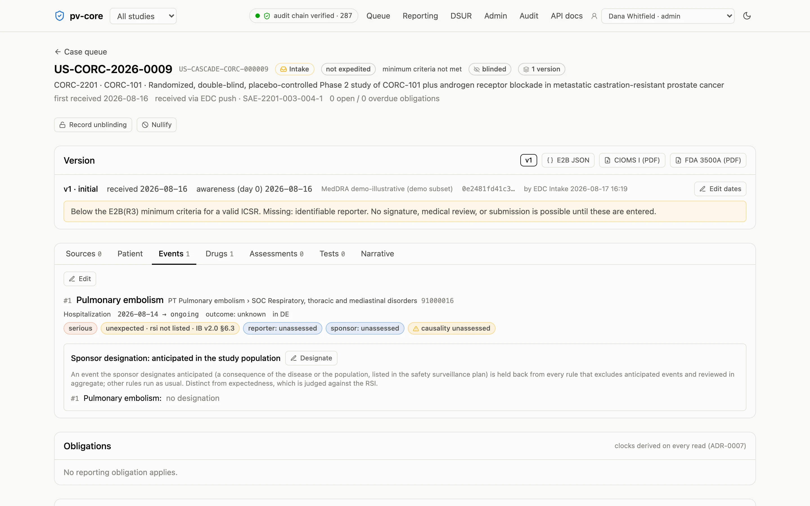

A case starts the moment a serious adverse event reaches the safety team, whether by
phone, fax, an SAE form, or a push from the EDC. In pv-core that moment is **New case**:
you record whatever arrived, and the app tells you what is still missing before the case
counts as a valid report. The [guided tour](/pv-core/evaluate/tour/#step-new-case) walks
through this page with a worked example.

## Where the report comes from

At the site, a coordinator, the treating physician, or the investigator recognizes a
serious event and reports it to the sponsor at once, with the investigator's view on
causality; FDA reads "immediately" as as soon as feasible and expects the initial report
generally within a calendar day (FDA, Investigator Responsibilities: Safety Reporting for
Investigational Drugs and Devices, December 2025, §V.A and §V.B). That report is usually a
paper or PDF SAE form sent by email or fax, sometimes a phone call, and it usually arrives
before the event has been entered in the EDC. It is the primary source for the case: enter
it here, attach the form, and do not wait for the EDC. The safety database is the record
of the report; the EDC's adverse-event page is the site's record of the trial, and the two
are reconciled later, not merged.

The Receipt card asks how the report arrived (email, fax, phone, an EDC push, or other)
and for the reference it carried: the message id, the fax cover, the call log. That
provenance shows on the case header and in the queue, so a monitor asking "where did this
one come from" has the answer without opening the attachment.

## What makes a case valid

ICH E2B(R3) sets four minimum criteria for a valid Individual Case Safety Report: an
identifiable patient, an identifiable reporter, at least one adverse event, and at least
one suspect (or interacting) drug. The new-case form shows the four as a checklist that
updates as you type. A case saved before all four hold is an **intake** item: it sits in
the queue, is fully editable, and has no regulatory clock yet. The clock starts the day
the sponsor first knows the case meets the criteria, and that day is recorded as the
version's **awareness date**.

## Day zero

The awareness date defaults to the date the information was received. When the two
differ (a report received Friday that only became a valid case on Monday when the
reporter's name arrived), set the awareness date deliberately and say why: the app
requires a rationale, and the audit trail keeps it. Every due date on the case counts
calendar days from this date.

## Entering the sections

The case page has one tab per E2B(R3) section:

- **Sources**: the reporters, with country and qualification, and which one is the
  primary source for regulatory purposes.
- **Patient**: initials, the study subject number, site, age and sex. Birth dates are
  avoided by design.
- **Events**: the reported term, its MedDRA coding (search the loaded dictionary and pick
  the Lowest Level Term; the app records the full path), the six seriousness criteria,
  onset and end dates, and the outcome. A fatal outcome requires the death criterion.
- **Drugs**: role (suspect, concomitant, interacting, not administered), the product,
  dose, route, dates, action taken, and whether the study drug was blinded.
- **Tests** and **Narrative**.

Every save is audited with the before and after values, so an open version can be edited
freely; the record of every edit is on the audit tab. Once a physician signs, the version
locks and any further change is a new version (see [clocks and
submissions](/pv-core/user-guide/clocks-and-submissions/)).

## Attaching source documents

Attach the SAE form, discharge summary, or correspondence from the case page. Files are
stored by their content hash; the same file attached twice is stored once, and a hash on a
submission record always names exactly the bytes that were sent.

## Intake from the EDC

A source system pushes cases in through the same API with an intake identity that can
create cases and attachments and read nothing back. What arrived is kept verbatim on the
case (the payload and its hash) so the provenance of every field is inspectable.

